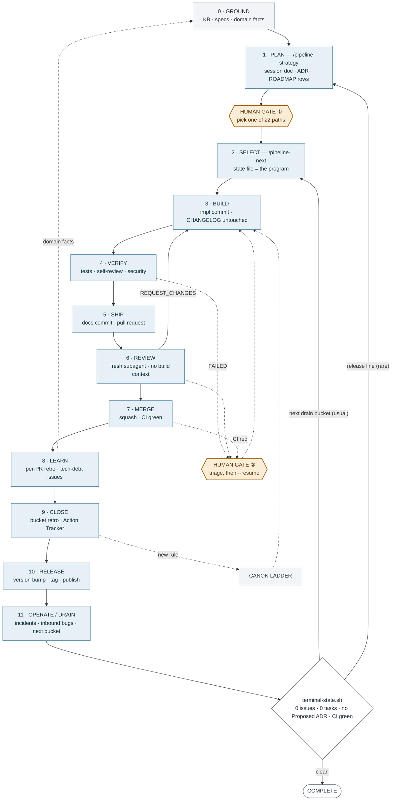
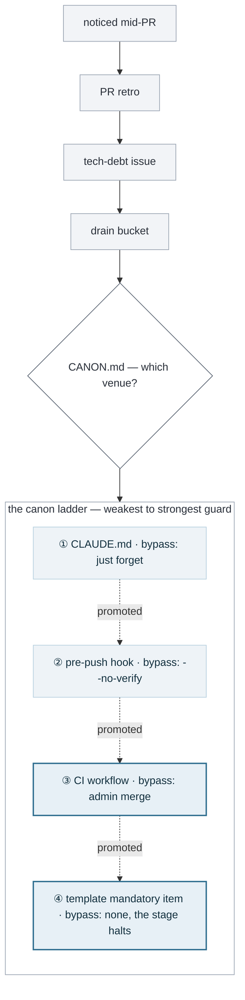

# The two-gate lifecycle

> The working model this harness implements: twelve stages from domain fact to
> published release, of which **two stop for a human** — choose the path, triage
> a failure. Everything in between is gated by verdict strings, mandatory
> checklist ticks, executable gate scripts, and CI.

> 📐 **A typeset version of this document, with the diagrams drawn properly, is
> published at
> [johnrtipton.github.io/pipeline-skills](https://johnrtipton.github.io/pipeline-skills/lifecycle-model.html).**
> This Markdown copy carries the same content for reading in-repo and in diffs.

This document describes the *shape* of the process, not the commands. For the
commands see the [README](../README.md); for the design rationale see
[CLAUDE.md](../CLAUDE.md); for where a rule should live see
[CANON.md](../CANON.md).

The model below was written against this repo, then **checked against a consumer
repo** (a Python/Rust Django framework project) that has run the harness roughly
440 times: 647 state files, 390 PR retros, 330 Action Tracker rows, 30+
pre-push hooks, 13 CI workflows. Where real usage contradicted the model, the
model changed — those corrections are called out inline.

---

## The loop

**Blue = machine-gated · amber = human gate · grey = standing context.** Only the
two amber nodes stop for a person; everything blue is gated by a verdict string,
a mandatory checklist tick, an executable gate script, or CI.

Stages 02–09 run many times per lap — several PRs per drain bucket, often
concurrently in separate git worktrees.

---

## Stage by stage

### 00 · Ground

- **Artifact** — KB / domain facts / `CLAUDE.md` canon
- **AI** — drafts and patches the KB from specs and from the "KB Updates Needed"
  section of every retro
- **Human** — supplies source material; settles domain disputes
- **Gate** — none; standing context, not a stage you pass

The harness ships nothing for this leg, but the consumer repo built one anyway
(`docs/ai/`, `llms.txt`, an AI best-practices doc, a conventions directory).
Treat it as load-bearing rather than optional.

### 01 · Plan — `/pipeline-strategy`

- **Artifact** — `docs/strategy-sessions/*.md`, an ADR if directional, ROADMAP rows
- **AI** — the full 8-stage strategy pipeline: survey → brainstorm → triage →
  cluster → present ≥2 paths → recommend
- **Human** — reads the paths and picks one
- **Gate ①** — **the real one.** Stage 7 refuses to capture until a path is
  chosen; [ADR-0003](adr/0003-loop-autonomy-boundary.md) makes this the only
  place `/pipeline-cycle` pauses by default. `--auto` removes it, which is
  exactly the right thing to make opt-in

> **Correction from real usage:** rarer than the design implies — 4 strategy
> sessions across ~440 runs, all at release-line boundaries. Formal planning is
> an event, not a cadence.

### 02 · Select — `/pipeline-next`

- **Artifact** — `.pipeline-state/<branch>.json`, the program counter
- **AI** — parses ROADMAP, filters by milestone and priority, batches related
  tasks, instantiates the template
- **Human** — nothing
- **Gate** — inherited from ①

### 03 · Build

- **Artifact** — implementation commit on a branch, CHANGELOG untouched
- **AI** — all of it, often several agents at once in separate worktrees
- **Human** — nothing
- **Gate** — machine only: mandatory checklist ticks plus
  `gate_changelog_boundary`. That gate exists because two implementer agents
  once ran concurrently on one checkout and both edited `[Unreleased]`

### 04 · Verify

- **Artifact** — `TESTS_PASSED` / `SECURITY_PASSED` verdicts, self-review notes
- **AI** — runs tests, the enumerated-unit inventory, the profile's security patterns
- **Human** — nothing unless it fails
- **Gate ②** — verdict extraction: FAILED overrides PASSED and halts the pipeline
  for `--resume`. The only unplanned way a human gets pulled in, and it fires
  from Verify, Review, or a red CI alike

> Self-Review is where canon accretes fastest: 5 mandatory items as shipped,
> 9 of 15 in the consumer repo, each addition naming its incident.

### 05 · Ship

- **Artifact** — docs + CHANGELOG commit, pull request
- **AI** — writes both commits and opens the PR
- **Human** — nothing; the PR is the human-legible artifact if you want one
- **Gate** — `gate_docs_only` enforces the two-commit shape

### 06 · Review

- **Artifact** — PR review comment, `APPROVE` / `REQUEST_CHANGES`
- **AI** — a **fresh subagent** with no build context reads the PR cold
- **Human** — optional read
- **Gate** — REQUEST_CHANGES loops back to Build. The context isolation is the
  load-bearing part; a same-session self-review would just rationalize

### 07 · Merge

- **Artifact** — merged PR, green CI
- **AI** — squash-merges. It cannot self-approve (GitHub blocks it), so it posts
  a review comment and merges
- **Human** — nothing
- **Gate** — CI plus the pre-push wall. In a mature repo that is 30+ hooks and a
  dozen workflows, not the three checks this repo runs on itself

> Merges may target an **active release line rather than trunk** — the consumer
> sets `pr_target_branch` to the dev line with an escape hatch to the
> stabilization line for P0 regressions.

### 08 · Learn

- **Artifact** — `pr/feedback/retro-N-*.md` (5 sections) plus a `tech-debt` issue
  per deferred finding
- **AI** — writes both; roughly 30–60 seconds per finding, and the PR still
  merges on schedule
- **Human** — nothing
- **Gate** — the hard programmatic `gate_retro_artifact`; the pipeline cannot
  report done without the file on disk

### 09 · Close — `/pipeline-retro --reconcile`

- **Artifact** — `RETRO.md` bucket entry, Action Tracker rows
- **AI** — dedupes across PR retros, files issues, updates the tracker
- **Human** — skims the tracker
- **Gate** — soft: verification sub-stages re-check every `Action taken:` line,
  so the machine audits itself

### 10 · Release

- **Artifact** — version bump, CHANGELOG cut, git tag, published package, notes
- **AI** — bumps the version, increments the RC, updates the changelog, verifies,
  tags, publishes
- **Human** — decides *when* to cut: RC train vs GA, which release line, whether
  the soak is done
- **Gate** — pre-release security audit, release-workflow dependency check, code
  scanning; automated, but the cut itself is a judgment call

> **Correction from real usage:** this stage was missing from the first draft of
> the model. Merged is not shipped. Real repos run RC trains, release branches,
> and a separate publish path — see [issue #69](https://github.com/johnrtipton/pipeline-skills/issues/69).

### 11 · Operate / Drain — `/pipeline-drain`, `/pipeline-roadmap-audit`

- **Artifact** — incidents, inbound bugs, and the next **drain bucket** (a named
  batch of 5–7 issues)
- **AI** — batches issues into buckets, audits ROADMAP drift, diagnoses bugs
- **Human** — is the source of production signal. The single externally-sourced
  bug beat everything dogfooding found, which is what
  [ADR-0002](adr/0002-outward-pivot.md) was written about
- **Gate** — `terminal-state.sh`: clean means stop, not clean means assemble the
  next bucket. Deferred issues must be closed or labelled
  `backlog`/`wontfix`/`someday`, or the loop livelocks under `--auto`

> **Correction from real usage:** this is the loop, not its tail. The consumer's
> ROADMAP is 4,886 lines of successive drain buckets, each shipping into the
> active release. Retro → issue → bucket → 5–7 PRs → retro, over and over.

---

## The ratchet

The pipeline ships its own features through itself — every version from v0.1.0
onward went through these stages, and `terminal-state.sh` once correctly
reported the milestone that built it as not-clean. That self-hosting is what
makes the loop improve: **a failure surfaced in one lap becomes a gate the next
lap cannot get past.**

**①→④ is the ratchet direction: each venue is harder to bypass than the last,
and the dotted edges are the promotion path** — a rule does not have to stay
where it first landed.

The four venues are ordered weakest to strongest guard, and the choice is not
arbitrary — [CANON.md](../CANON.md) gives the decision rule: *fires on every PR,
prose discipline, not runtime-checkable → template canon.*

Three properties make it a ratchet rather than a filing cabinet:

- **Rules climb.** Where a rule lands is not where it stays.
  [ADR-0001](adr/0001-executable-quality-gates.md) moved the quality gates from
  prose inside `SKILL.md` into `scripts/pipeline-gates.sh` — same rule, one rung
  up, now executable by CI as well as by the agent.
- **It takes effect on the very next run.** Templates are re-read from disk
  between stages, so a checklist item added after this morning's incident gates
  this afternoon's PR. No skill reinstall, no session restart.
- **It improves for everyone.** The consumer repo files findings back at this
  harness under a tracker status it invented for the purpose — 41 rows. Fixes
  made here land in the templates every other repo inherits.

The intake is asynchronous by design: a finding noticed during feature A never
blocks feature A. It waits in a retro, becomes an issue, and gets processed in a
bucket built for it. See
[CLAUDE.md § Capture everything, block nothing](../CLAUDE.md).

---

## It reshapes to the repo

The same skill files behave differently in every repository, because four layers
merge at runtime — each able to override the last.

| # | Layer | What it sets |
|---|-------|--------------|
| 1 | Built-in template | Stage skeleton, verdicts, baseline mandatory items (`templates/*.json`) |
| 2 | Built-in profile | Framework security patterns and auto-reject triggers; selected by detection (`manage.py` → django, else generic) |
| 3 | Project `CLAUDE.md` | Default branch, PR target, test / lint / build commands, changelog style, profile and agent overrides |
| 4 | Per-repo overrides | `.pipeline-templates/` and `.pipeline/profile.json` — extra checklist items, patched stages, a different PR target |

[`/pipeline-init`](../skills/pipeline-init/SKILL.md) writes layers 3 and 4 by
detection — default branch, test/lint/build commands, ROADMAP format, version
scheme — and migrates a foreign-format ROADMAP into the one the parser actually
reads. It was proven on a deliberately hostile repo: `master` instead of `main`,
Node instead of Python, `npm test`, a checkbox ROADMAP. Migrated, ran end to
end, PR opened against `master`, reviewed, squash-merged
([validation report](validation/2026-06-04-foreign-repo-e2e.md)).

**Same harness, two repos.** Here it runs `make check` on a stdlib script with
no test runner and targets `main`. In the consumer it runs 30+ pre-push hooks
across Python and Rust, targets an active release branch instead of trunk, and
greps every diff for a gitignored list of private identifiers. Nothing in
`skills/` differs between them — the entire difference lives in layers 3 and 4.

---

## What it looks like at scale

Measured on the consumer repo at ~440 harness runs:

| Figure | What |
|--------|------|
| 647 | pipeline state files (~440 typed runs) |
| 390 | per-PR review artifacts |
| 323 / 330 | Action Tracker rows closed |
| 4 | strategy sessions in ~440 runs |
| 25 | "process canonicalizations from *X* retro arc" sections in `CLAUDE.md` |
| 41 | findings filed back at this harness |

Three things that survived contact:

- **The skeleton is unchanged.** Same 14-stage template, same stage names, same
  subagent split at Code Review / Merge / Retrospective. What grew is density —
  mandatory checklist items roughly doubled, each addition citing its incident.
- **All four canon venues fill up, in the predicted order.** `CLAUDE.md` carries
  25 retro-arc sections across 1,543 lines; the pre-push wall runs 30+ hooks
  including repo-specific ones; CI runs 13 workflows — one of which is a daily
  audit for merged PRs that skipped their retro, which is precisely CANON.md's
  worked example, built for real.
- **The upstream channel is the surprise.** A tracker status this harness never
  defined marks findings blocked on it, excluded from the consumer's own open
  count. The consumer instrumented its feedback into the tool.

---

## Known gaps

**Evals are the thin leg.** The harness ships *checks* (CI, gate scripts,
template validator) and *validation runs* (foreign-repo e2e), but no eval suite.
Nothing upstream measures the thing the whole design claims: *does the executor
still tick Stage N when context is under pressure?* The consumer built the
prototype — a bypass-audit script plus a daily workflow that scans merged PRs
for missing retro markers — and it has never been promoted here.

That, and ten other findings surfaced by the same audit, are captured in
[ROADMAP.md § Future → Upstream candidates](../ROADMAP.md) with matching Action
Tracker rows and GitHub issues. The top five:

| Issue | Candidate | Why |
|-------|-----------|-----|
| [#68](https://github.com/johnrtipton/pipeline-skills/issues/68) | Retro-bypass audit | The only existing *measurement* of the family's central promise. CANON.md already cites it as the CI-venue worked example; the harness ships nothing |
| [#69](https://github.com/johnrtipton/pipeline-skills/issues/69) | Release stage | Merged ≠ shipped — RC trains, release branches, publish path all run outside the model |
| [#70](https://github.com/johnrtipton/pipeline-skills/issues/70) | Release-line PR targeting at init | `pr_target_branch` is honoured but init detects only the default branch |
| [#71](https://github.com/johnrtipton/pipeline-skills/issues/71) | `OUT-OF-REPO` tracker status | Findings blocked on another repo must not stall the loop toward terminal |
| [#72](https://github.com/johnrtipton/pipeline-skills/issues/72) | Specify `.pipeline-log.md` | Both repos keep a PR ledger by hand; neither skill writes it |

The rest ([#73–#78](https://github.com/johnrtipton/pipeline-skills/issues?q=is%3Aissue+label%3Atech-debt)):
drain-bucket cadence as documented canon, concurrency guidance, forbidden-identifier
scan as a profile feature, the extra pipeline types, canon-compaction guidance, and
executor eval fixtures.

---

## The honest read

Two human gates exist in practice: **choose the path** and **triage a failure**.
Everything between is machine-gated by verdicts, mandatory checklist ticks,
executable gates, and CI. That is the correct allocation — humans are best at
"which direction" and worst at "did stage 11 of 14 actually run," and the
machine is the reverse.

The part worth stealing even if you never adopt this harness: **a process that
only gets stricter.** Most conventions decay — someone documents a rule,
everyone forgets it, the rule dies in a stale wiki. This one runs the other
direction, because a lesson is only finished when it has been promoted to a
venue that can refuse the next PR. The stage list is the visible artifact; the
ratchet is the actual product.
